# Investment Portfolio Simulator

A data-driven project designed to help beginner investors make informed decisions by combining market analysis with portfolio simulation.

---
## 🎯 Problem

Beginner investors are often advised to invest in indices because they provide diversification.

However, this raises several important questions:

- Why do some indices outperform others?
- Is this outperformance stable over time?
- What actually drives it?
- Can this knowledge help achieve a financial goal?

---
## 🧠 Research Flow
### 1. Initial Observation

While exploring the market, I noticed that NASDAQ-100 (QQQ) showed higher returns compared to other major indices.

However, a strong performance at a given moment does not necessarily mean that this is a consistent long-term trend.

Question:

Is this outperformance structural or just temporary?

---
### 2. Data Preparation

To answer this question, I collected and prepared data for NASDAQ-100 (QQQ) and other major indices (SPY and DIA).

The preparation process included:

- aligning time series data  
- handling missing values  
- standardizing key metrics:
  - average annual return  
  - volatility  
  - Sharpe ratio (initially used to define acceptable risk levels)  
  - risk boundary lines (introduced later as a clearer alternative to the Sharpe ratio)

During the process, I realized that the Sharpe ratio was not intuitive enough for defining investment strategies for beginners.  
Because of this, I replaced it with risk boundaries based on volatility levels.

Conclusion:

The dataset is now consistent and suitable for comparison.

---
### 3. Hypothesis: Structure Drives Performance

After preparing the data, I started by analyzing the structure of the NASDAQ-100.

I collected the list of companies included in the index using public sources such as Wikipedia.

What is tested:

Sector distribution of NASDAQ-100.

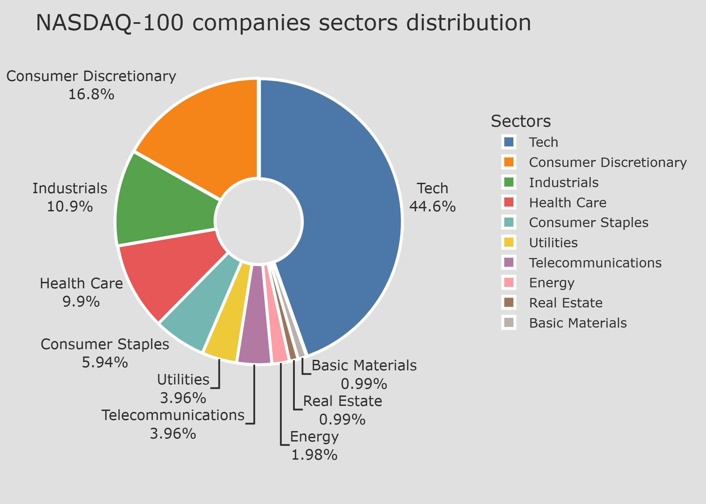

Finding:

The index has a high concentration in technology (~42%).

Conclusion:

Exposure to the technology sector is likely a contributing factor to higher returns, but it does not guarantee consistent long-term performance.

Limitation:

This observation does not prove causality and does not guarantee future performance.

Next step:

Check whether this growth is stable over time.

---
### 4. Hypothesis: Growth Must Be Persistent

To understand whether the performance is consistent, I analyzed historical data from Yahoo Finance (2015–2025).

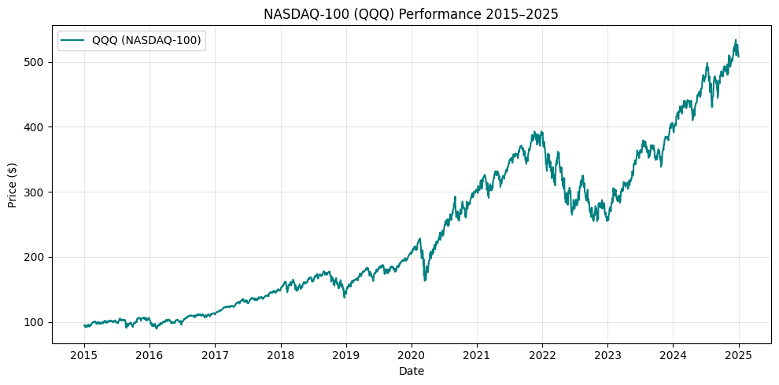

Finding:

- a clear long-term upward trend  
- noticeable short-term drawdowns  

Conclusion:

Growth is persistent over the long term but comes with volatility.

Limitation:

This analysis is based only on historical data and does not account for structural economic changes.

Next step:

Compare QQQ with other major indices.

---
### 5. Hypothesis: Relative Performance Must Be Benchmarked

To understand whether QQQ is truly exceptional, I compared it with SPY and DIA.

What is tested:

QQQ vs SPY vs DIA performance.

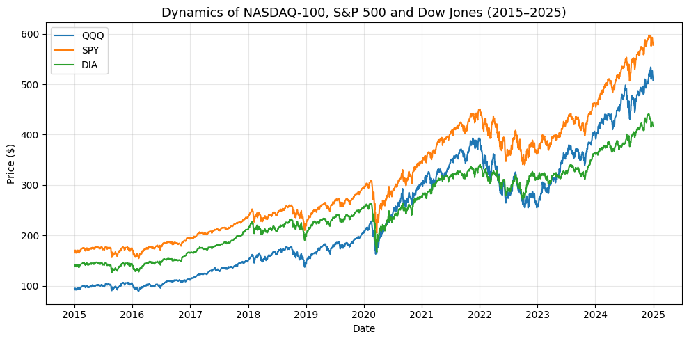

Finding:

- indices follow similar trends over time  
- QQQ appears to grow faster, but this is not clearly distinguishable from this visualization alone    

Conclusion:

There is a visible relationship between the indices.

Next step:

If indices move similarly, it is worth checking whether QQQ carries higher risk.

---
### 6. Hypothesis: Higher Return Comes with Higher Risk

Observation:

QQQ shows higher returns.

Key question:

Does it also carry a higher risk?

What is tested:

Relationship between return and volatility.

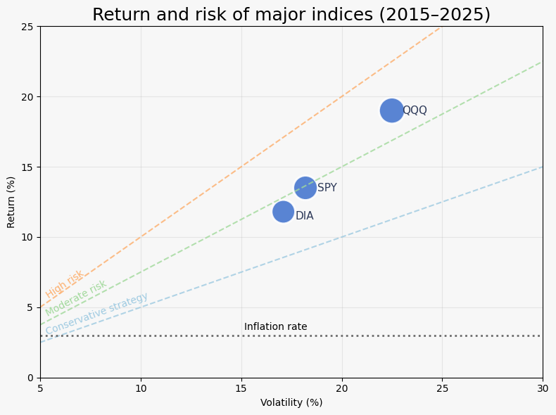

Finding:

- QQQ has higher returns  
- QQQ also has higher volatility  

Conclusion:

Higher returns are associated with higher risk.

Next step:

Investigate whether index composition explains this behavior.

---
### 7. Hypothesis: Overlap Explains Correlation

To understand why indices behave similarly, I analyzed the overlap between their components using a Venn diagram.

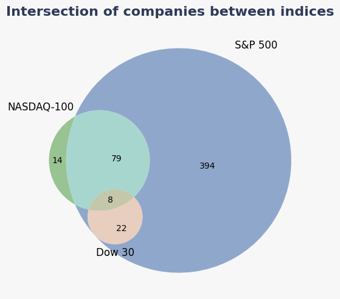

Finding:

- strong overlap between indices  
- NASDAQ-100 contains ~13–14 unique companies  

Conclusion:

Overlap explains similar movement, but not higher returns.

Next step:

Focus on unique companies.

---
### 8. Hypothesis: Unique Companies Drive Outperformance

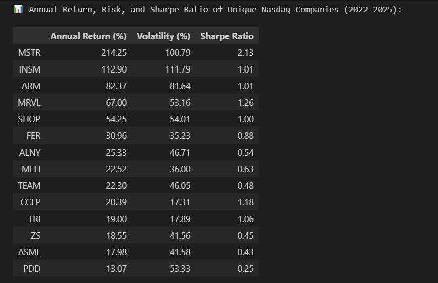

Finding:

- unique NASDAQ companies show higher returns  
- they also have higher volatility  

Conclusion:

These companies likely drive both the higher return and higher risk of QQQ.

New issue identified:

At this stage, return was evaluated mainly through price growth.

However, individual companies also generate income through dividends.

Next step:

Include dividends in the analysis.

---
### 9. Methodological Check: Dividend Inclusion

Problem:

Ignoring dividends may distort total return.

What is tested:

Dividend contribution to total return.

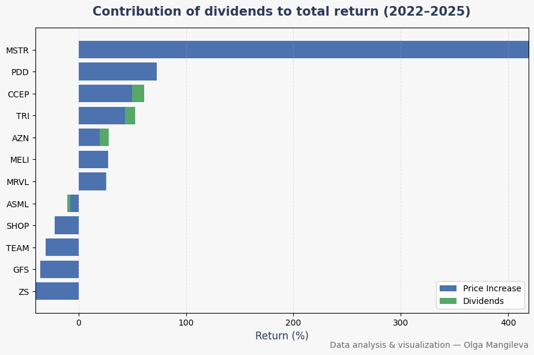

Finding:

- dividends contribute a smaller share  
- price growth remains the dominant factor  

Conclusion:

Including dividends improves accuracy, but does not change the overall conclusion.

---
## ⚠️ Limitations

- based on historical data (2015–2025)  
- sensitive to time period selection  
- possible survivorship bias  
- correlation does not imply causation  
- macroeconomic changes are not modeled  

---
## 🔄 Transition to Product

Analysis explains market behavior, but does not answer a practical question:

> Can a specific investment strategy help achieve a financial goal?

---
## 🚀 Investment Goal Simulator

Based on this analysis, I developed a tool that helps answer this question.

---
### User Inputs

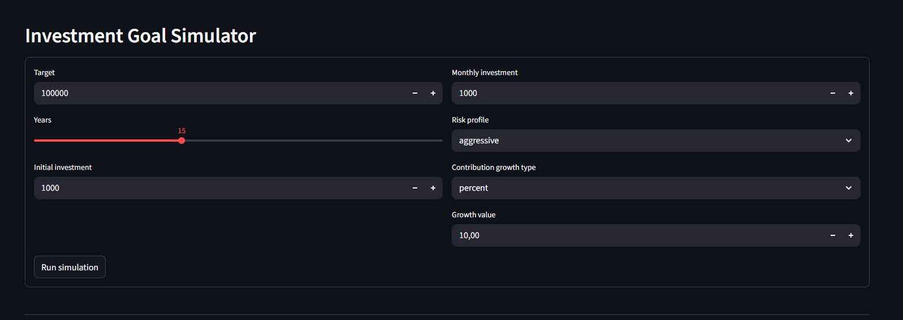

The user defines:

- investment horizon  
- monthly contribution  
- contribution growth (percentage or absolute)  
- initial capital  
- risk tolerance  

---
### Strategy Profiles

Strategies are based on acceptable levels of volatility:

- Conservative (up to 25%)  
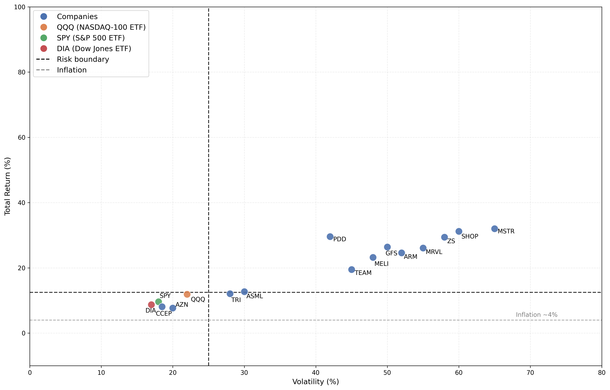

- Moderate (up to 33%)  
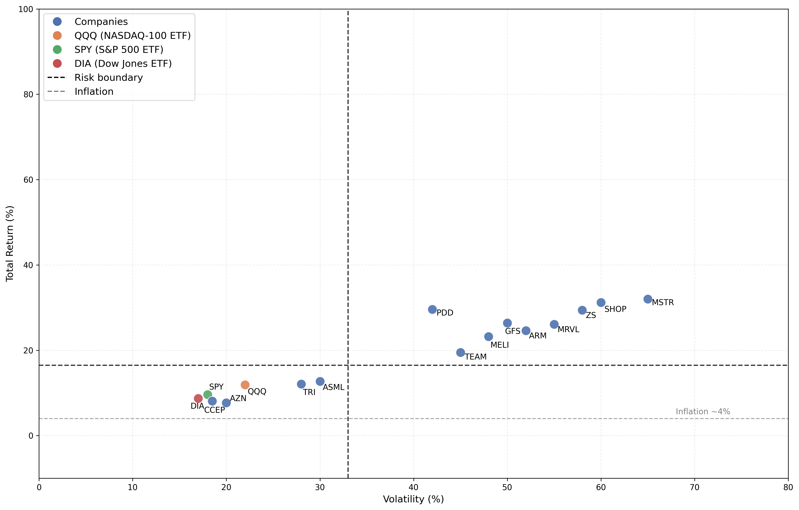

- Aggressive (up to 50%)  
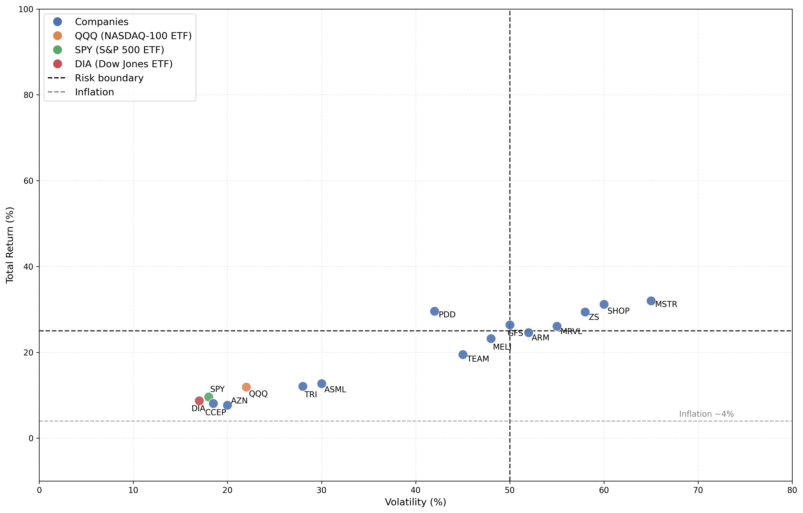

- Ultra Aggressive (up to 66%)
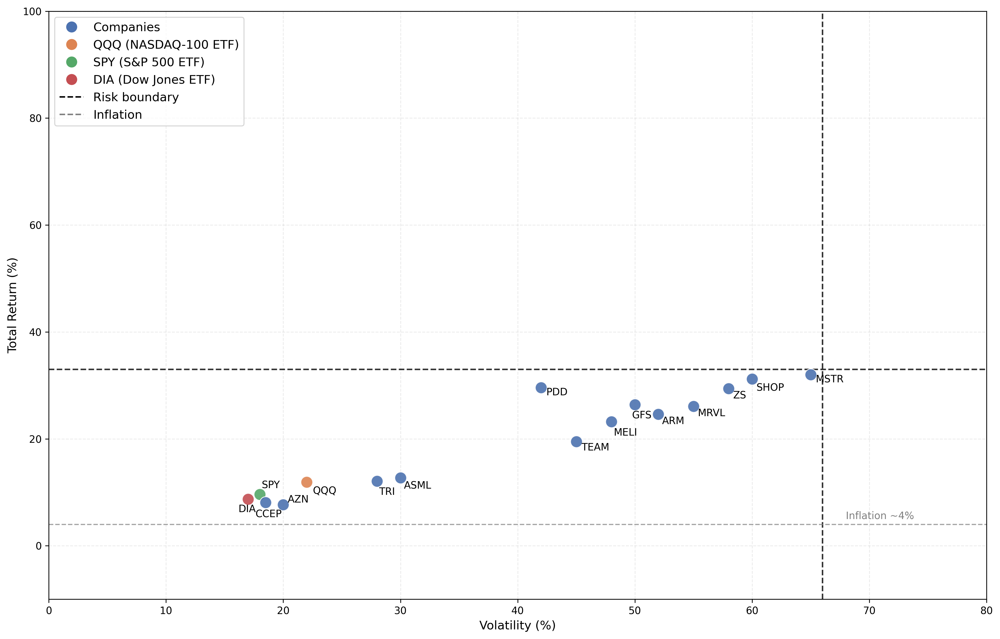

---
### Portfolio Construction

The system suggests a portfolio of top assets based on the selected strategy.

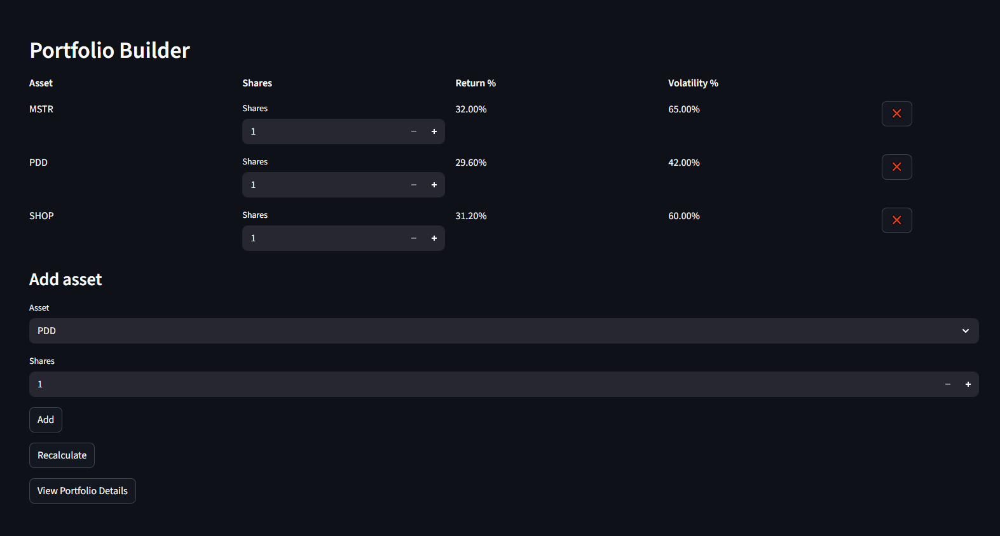

The user can:

- adjust asset weights  
- add or remove assets  
- rebuild the portfolio  

The system then recalculates expected return and risk.

---
### Portfolio Details

After confirming the portfolio, the user can view detailed results:

- total invested capital  
- total profit  
- final portfolio value  
- effective annual return  

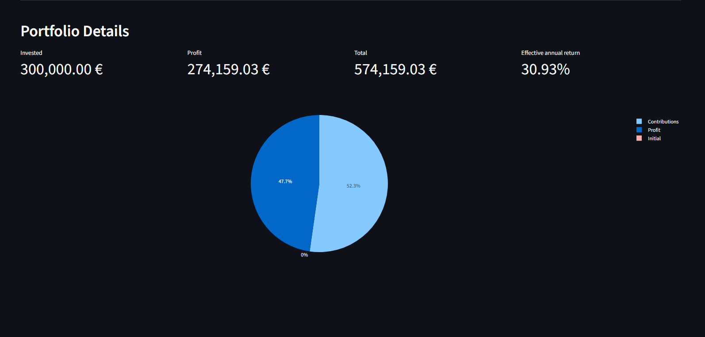

---
### Growth Dynamics

The chart shows:

- investment growth over time  
- contribution vs profit  
- total value dynamics  

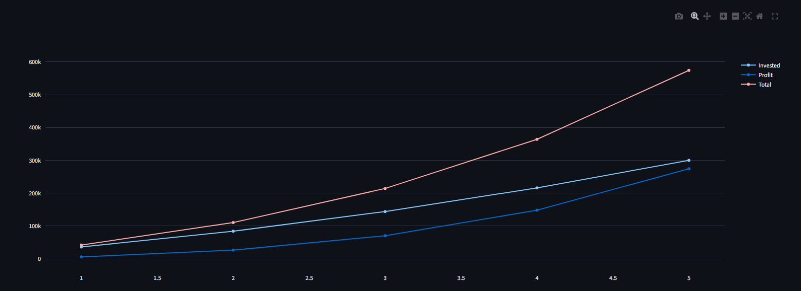

---
### Detailed Breakdown

A detailed table provides:

- yearly breakdown  
- monthly breakdown  

Including:

- starting balance  
- contributions  
- earned interest  
- ending balance  

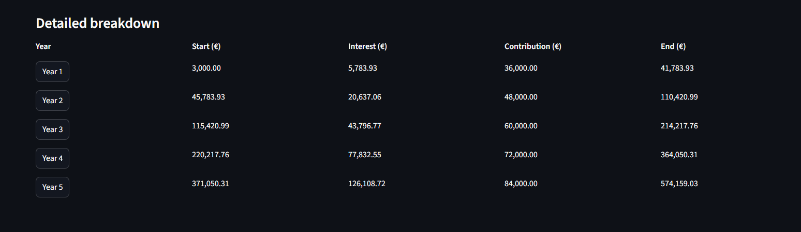

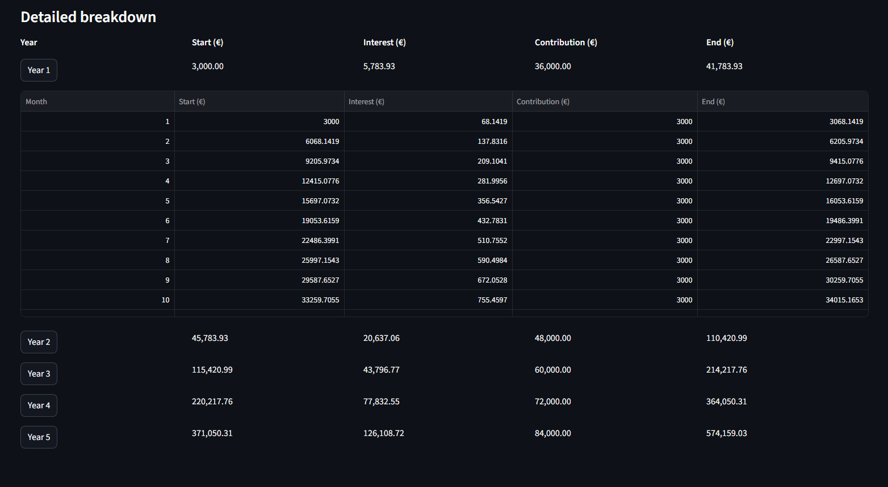

---
## 💡 Final Conclusions

- index performance depends on its composition  
- a small group of companies can drive most of the return  
- higher returns are associated with higher volatility  
- analysis should be translated into practical tools for decision-making  

---
## 🛠 Tech Stack

- Python  
- Pandas  
- NumPy  
- Matplotlib / Plotly  
- Streamlit  

---
## 📌 Author
Olga Mangileva
